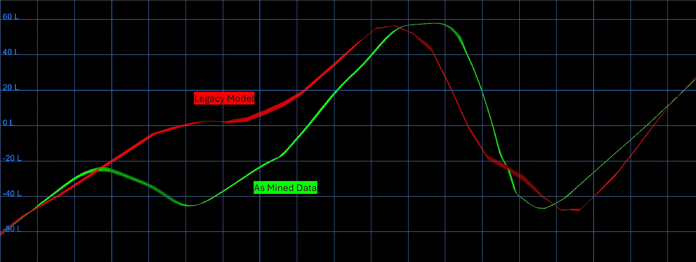

Beyond Traditional Methods:

Radial Basis Functions for Stratigraphic Modelling Innovation in Complex Coal Deposits

Norman Heckscher^1^, Andrew Hughes^2^, Barry Saunders^1^ and Glynne Owen^3^

1.QGESS Pty Ltd, Brisbane

2.Golding Contractors, Brisbane

3.JB Mining Services, Brisbane

Abstract
========

Inaccuracies in the stratigraphic models of coal deposits can result in significant financial losses and operational disruptions in the coal industry. The two common modelling approaches are using independent structural surfaces for roof and floor or stacking thickness grids from a reference surface. These approaches are adequate for the majority of coal deposits but display difficulties in representing the complex geological structures encountered in steeply dipping and folded coal deposits. These methods encounter challenges with conflicting control strings, inconsistent thickness representation, and the inability to accurately account for true stratigraphic thickness in the presence of dipping strata and non-vertical boreholes. This paper presents a novel stratigraphic modelling methodology by combining in-situ data, trigonometric calculations for true thickness determination, and Radial Basis Functions (RBFs) for smooth interpolation of thickness grids. Application of this approach to complex coal deposits has demonstrated improved reconciliation between scheduled tonnages and geological models. The findings suggest this methodology has the potential to enhance the accuracy and precision of coal volume estimation, contributing to more effective production forecasting and resource management in the coal industry.

Introduction
------------

A primary challenge in coal operations is the mismatch between modelled and actual production volumes. This discrepancy arises from multiple factors, and apart from mining practices, is determined by the structural complexity and limitations of modelling methods.

Traditional modelling approaches, including the use of independent structural surfaces for roof and floor and the stacking of thickness grids on a reference surface, often fall short in accurately representing the complex geological structures in steeply dipping and folded coal deposits (Figure 1). These methods grapple with challenges such as conflicting control strings, inconsistent thickness representation, and the inability to precisely account for true stratigraphic thickness when strata are dipping, and boreholes are non-vertical.

These challenges can lead to significant over- or under-estimation of coal volumes, resulting in financial losses, missed production targets, and inefficient mine planning. Despite the industries awareness of these challenges, traditional modelling algorithms have seen minimal innovation for decades.

While the modelling approaches to less structurally complex coal seams have historically been successful in large-scale operations (>8 Mtpa), their accuracy may not be sufficient for smaller operations (1-3 Mtpa) in complex geological settings. In complex deposits, even minor variations can significantly impact the ability to meet production goals. Given the advancements in computing technology, a reassessment of the industry-standard modelling algorithms, some of which have been in use for over 30 years, is warranted to determine their continued suitability.

The Need for a New Approach
---------------------------

While previous studies investigating the estimation of global and local coal reserves have focused on geostatistics & drill hole spacings (Armstrong et al., 1989), the advent of advanced computing technologies and the increasing complexity of coal deposits necessitate a re-evaluation of traditional stratigraphic modelling methods. With gently dipping deposits exhausting, the need to extract seams with grades greater than 10% will become common place. It is now time to develop and adopt new approaches that leverage modern technologies and address the specific challenges inherent to modelling complex coal deposits.

This paper aims to present a novel stratigraphic modelling methodology that overcomes the limitations of traditional methods. By incorporating in-situ data, trigonometric calculations for true thickness determination, and Radial Basis Functions (RBFs) for smooth interpolation, this new approach has the potential to improve the accuracy and precision of coal volume estimation.

**Traditional Modelling Methodologies. Two approaches.**

1. Model roof and floor separately using separate sets of control strings (independent surfaces)

2. Model reference surface and thickness separately and add/subtract thicknesses from reference surface to obtain roof/floor (stacking)

**Independent Surfaces Method**

The independent surfaces methodology suffers from two specific problems in structurally complex deposits: -

1. Many control strings/points needed.

2. Difficulty maintaining these strings within the model through areas of increasing geological complexity.

The independent surfaces method models the roof and floor of the coal seam as distinct surfaces. This approach often relies on control strings and Delaunay Triangulation, which can lead to several challenges. Conflicts between roof and floor control strings determining seam thickness & position are not uncommon, impacting seam thickness and position. Additionally, maintaining separate string sets for both surfaces is labour-intensive and can result in inconsistencies in seam thickness determination. This is because the thickness is calculated as the difference between the two surfaces rather than through a consistent algorithmic approach. In some cases, these surfaces may intersect or exhibit unrealistic thickening or thinning.

Modelling geological structures, whether the roof or floor of a coal seam, often involves the use of control points or lines to interpret the structure in areas with limited data. The Delaunay Triangulation algorithm is commonly employed to generate a surface based on these control points. However, the number of control points required can be substantial, especially in geologically complex areas or regions with sparse exploration data. Maintaining and updating these control points can be a significant challenge, often requiring considerable time and effort.

Figure 1: Cross section comparison of structural surfaces generated with traditional modelling techniques and as-mined survey data overlay.

Figure 1 illustrates potential pitfalls of this approach. The previous model, generated using traditional methods, resulted in difficulties achieving satisfactory coal recovery during mining operations. In contrast, the modified modelling technique applied to the same dataset has yielded structural surfaces which closely align to as-mined survey data without the need for costly production drilling and geophysical logging programs.

The challenge of maintaining and updating control points underscores the need for alternative modelling approaches that are less reliant on manual intervention and offer greater robustness in the face of data limitations.

**Stacking**

The stacking method involves creating a reference surface using a single set of control strings (used to guide the model in areas of structural complexity), borehole data, and Delaunay Triangulation. Thickness grids are then created and added/subtracted from this reference surface to generate the roof/floor surfaces above/below. Mid burden thickness can also be modelled with this process if desired. This method offers several advantages over the dual-surface approach, including a reduced number of control strings to maintain and the ability to directly manipulate seam thickness.

However, the stacking method has limitations in accurately representing true thickness, particularly in areas with dipping strata and non-vertical boreholes. This is partly due to the prioritisation of control strings and smoothing algorithms over borehole data in some modelling processes. In certain cases, the resulting model may significantly deviate from known exploration and survey data points. These deviations, which can be as large as 20 meters, can lead to substantial errors in volume estimation.

**Problems with the two methodologies.**

The authors identify three key challenges in traditional coal seam modelling in complex deposits:

1. accurately determining true thickness,

2. modelling dipping strata,

3. and accounting for non-vertical exploration holes

These challenges are exacerbated by the complex geological settings often encountered in modern coal mining, where rapidly changing strike and dip can lead to errors in thickness estimation if data points are inadequately spaced or interpolation methods fail to capture the nuances.

While the density and quality of exploration data are crucial for model accuracy, tools like dipmeters, though valuable for understanding structural orientation, can be limited by hole deviation and measurement inaccuracies (Saunders, 1990).

Field observations in areas with significant folding have revealed localised seam thickness variations of up to ±50% when intersected by thrust faulting and associated jointing. These variations underscore the need for modelling techniques that can accurately capture the complexities of geological structures.

Figure 2**: **A cross-section through a steeply dipping anticline structure, highlighting the differences between the legacy and modern roof models.

Figure 2 presents a cross-section through a steeply dipping anticlinal structure, highlighting the differences between the legacy and current roof models. The legacy model, based on traditional methods, results in significant variations in seam thickness, particularly in the fold axis. This is inconsistent with the expected geological behaviour of coal seams, which typically form with relatively uniform thicknesses. In contrast, the current model, generated using the new methodology, exhibits a consistent true thickness across the deposit, more accurately accounting for dipping strata and non-vertical boreholes.

The cross-section in Figure 2 displays six surfaces:

1. Floor surface: Represents the base of the coal seam.

2. Legacy roof surface: The top of the coal seam as predicted by the traditional model.

3. Modern roof surface: The top of the coal seam as predicted by the new methodology.

4. Legacy thickness surface: The difference between the legacy roof and floor surfaces.

5. Modern thickness surface: The difference between the modern roof and floor surfaces.

6. True thickness surface: The actual thickness of the coal seam, often derived from in-situ measurements and geological interpretation.

The true thickness surface (red) is relatively flat, while the legacy thickness surface shows significant deviations, especially at the fold axis. Similar discrepancies are observed along the limbs of the structure.

It is important to note that Figure 2 illustrate the stacking method applied with the floor as a reference surface. However, the recommended approach is to stack from the roof down. This is because measurements taken from the coal roof contact are generally more reliable and easier to obtain than those taken from the floor contact.

**Radial Basis Functions Vs Inverse Distance Weighting**

Figure 3: Sine wave reconstruction from scattered points with IDW² and a Linear Radial Basis Function

Inverse Distance Weighting (IDW) and Delaunay Triangulation have been coal industry standard modelling algorithms for decades (Maxwell, Rajabi, & Esterle, 2021).

When modelling thin seams with complex geology, IDW is not the best choice as it assumes all the input data points are local minimums or maximums. These max/min points create "bullseye" patterns around observation points. RBFs can create surfaces passing through observations points without the "bullseye".

Radial Basis Functions are known to produce smoother interpolations with reduced oscillation compared to Inverse Distance Weighting Figure 3. Yilmaz (2007) demonstrated this advantage in surface modelling using scattered point data. Our study builds upon this work, extending the comparison of RBF and IDW to both synthetic and real-world applications. The ongoing pursuit of excellence in stratigraphic modelling can be significantly advanced by integrating more sophisticated and appropriate algorithms like RBF.

**Impact of Borehole Deviation and Dipping Strata on Seam Thickness Modelling.**

Geologists know from field observations and verticality logs that exploration drill strings tend to deviate as they intersect the boundaries of lithologies of differing hardness (Figure 4 & 5). Achieving a perfectly vertical, large-diameter (100mm) drill hole through highly deformed strata is technically challenging. While exploration holes rarely intersect coal seams and associated strata at perfect right angles, the resulting deviation is typically insignificant for horizontal seams. However, in steeply dipping sediments, the deviation can be substantial. This deviation may provide insights into geological structures such as synclines and anticlines, but such interpretations require a thorough investigation by the geologist.

*Figure 4:**Exploration drill strings tend to "wedge off" and deviate to intersect the sandstone/coal beds perpendicularly. Syncline and anticline structures can be subjectively interpreted and estimated from this deviation. Exploration holes are never perpendicular to a perfectly horizontal layer of coal.*

*Figure 5:Conditions under which the calculation of true stratigraphic thickness according to its equation will be in error. (a) Large variation in stratigraphic thickness relative to the downdip deviation of the well path. (b) Change in dip causing an error in the estimation of true stratigraphic thickness. (AAPG Wiki, n.d.)*

**Comparison of Z-Delta and Euclidean Distance Methods for Thickness Estimation.**

*Figure 6: Comparison of Z-delta (purple) and Euclidean distance (grey) methods for seam thickness estimation in a dipping seam intercepted by an angled borehole. The Z-delta method underestimates the true thickness. (G. Jones, JB Mining, personal communication, July 5, 2024)*

Traditional geological modelling approaches use the Z-delta method for calculating coal seam thickness. This method, while suitable for gently dipping seams and vertical boreholes, can lead to significant estimation errors in the complex geological settings often encountered in modern coal mining operations (Figure 6).

In contrast, using the Euclidean distance to directly measure the shortest distance between the roof and floor of the seam, regardless of borehole angle, allows for improved calculation of true thickness and real apparent vertical thickness. This makes it a more accurate approach for estimating seam thickness in steeply dipping seams or when boreholes are not vertical.

The choice between these methods can impact volume estimation. As mining operations increasingly target more geologically complex deposits, the use of appropriate and accurate estimation methods becomes crucial.

**Stratigraphic Modelling - The Way Forward**

The industry will benefit from new ways of modelling complicated geology in stratiform. The following five steps have been successful in creating a stratigraphic model in complex, faulted and steep dip strata which reconciles well with "as mined" surfaces.

1. Create structural reference surface.

2. Determine true thickness at empirically observed roof/floor survey point pairs (exploration & insitu survey pickups & geophysically logged Drill and Blast holes).

3. Model a smooth true thickness grid surface across the deposit incorporating these scattered points using Radial Basis Functions.

4. Convert every grid point in the true thickness surface to an apparent vertical thickness.

5. Subtract the apparent vertical thickness surface from the structural roof reference surface to create a floor surface.

The modelling of a true thickness algorithm can also benefit from various custom settings when Python is used. The *Field Geologist's Manual* (Berkman & Australasian Institute of Mining and Metallurgy, 2011) details true and apparent thickness calculations using trigonometry. Strike and Dip are used to determine true/apparent thickness and can be obtained from the reference surface. Radial Basis Functions provide a modern way of modelling true coal thickness with scattered data points. RBFs are established tools in the modelling of hard rock deposits. Their potential benefits in stratigraphic modelling, particularly for coal deposits, warrant further exploration and adoption by practitioners seeking to enhance the accuracy and precision of their complex or steep dip models.

The ability to export grid surfaces in raw CSV format has enabled geologists to further analyse and manipulate their data. These csv grids can be imported into Python memory spaces where numerous modelling algorithms can be executed. The Python coding language is currently a very popular code language globally, has an incredible support base and a very large library of open and verified mathematical modules which can be used for modelling (McKinney, 2022).

Modelling methodologies with limited user control often offers a restricted set of modelling algorithms, such as Triangulation, Inverse Distance, Kriging, Spline, Least Squares, and Trend Surface. Utilising Python and raw point data opens a wider range of algorithms that were computationally infeasible in the past. Modern computing power, readily available in laptops today, can now be leveraged to create more sophisticated geological models. Ideally, modelling methodologies would incorporate a standardised Application Programming Interface (API) that interfaces with Python, enabling the integration of new algorithms as they are developed.

The derivation presented here follows Dennison (1968).

True thickness when the bedding dip is greater than that of the topography (Figure 7):

t = |h cos α sin δ - v cos δ|

*Figure 7: Bedding is greater than the dip of the topography (Dennison, 1968).*

True thickness when the bedding dip is less than that of the topography (Figure 8):

t = h cos α sin δ+ v cos δ

*Figure 8: Bedding is less than the dip of the topography (Dennison, 1968).*

**How accurate are RBFs?**

Coal deposits typically originate in gently undulating floodplains and swampy areas. Radial Basis Functions excel at generating smooth surfaces from abundant data points, making them particularly well-suited for modelling gently varying surfaces like those found in coal deposits. In studies relating to similar subsurface modelling for groundwater, RBFs have been found to outperform IDWs (Adhikary & Dash, 2014).

RBFs belong to a class of exact interpolation techniques, meaning the generated surface precisely passes through each measured data point. This characteristic ensures that the model honours the raw data without introducing artificial smoothing or artefacts. RBFs can be visualised as fitting a flexible membrane through the data points while minimising the overall curvature of the surface. Notice the sine wave reconstitution in Figure 3 which simulates a geological cross section, the surface passes through the data values.

Unlike global and local polynomial interpolators, which are inexact and do not necessarily pass through every data point, RBFs prioritise data fidelity. Compared to another exact interpolator, Inverse Distance Weighting, RBFs offer greater flexibility in predicting values beyond the observed range. While IDW is constrained by the minimum and maximum measured values, RBFs can extrapolate beyond these limits, potentially capturing subtle trends in the data.

Optimal parameters for RBFs are determined through cross-validation with differing parameters and standardised baseline surfaces. However, RBFs may not be suitable for modelling abrupt changes in surface values or when data quality is uncertain. Additionally, due to their smoothing nature, RBFs are not appropriate for modelling across fault boundaries. Therefore, it is recommended to employ fault block modelling, by dividing the area of the coal seams into structural domains which are separate areas bounded by faults to ensure accurate representation of the geological structure.

*Figure 9: A synthetic digital elevation model (DEM) was generated to simulate a coal seam environment. The DEM approximates a hillside terrain, incorporating creek-like features commonly observed in subsurface coal seams.*

*Figure 10: The synthetic surface was sampled at randomly distributed (x, y) locations, and the corresponding z (elevation) values were used to reconstruct the terrain using both Inverse Distance Weighting Squared (IDW²) and Linear Radial Basis Function (RBF) interpolation.*

To illustrate the comparative effectiveness of spatial interpolation techniques, a synthetic digital elevation model (DEM) was generated to simulate a coal seam environment (Figure 9). The DEM approximates a hillside terrain, incorporating creek-like features commonly observed in subsurface coal seams. This synthetic surface was then sampled at randomly distributed (x, y) locations, and the corresponding z (elevation) values were used to reconstruct the terrain using both Inverse Distance Weighting Squared (IDW²) and Linear Radial Basis Function (RBF) interpolation (Figure 10). The visual comparison readily demonstrates the superior representativeness of the RBF algorithm in accurately replicating the original terrain features.

**How To Integrate RBF Modelling**

**Structure Updates**

Regularly update the structural model using in-situ observations during mining, including:

1. Survey data from surface scans and point cloud digitisation.

2. In-situ survey pickups from the coal face and roof/floor.

3. Direct visual observations and measurements.

4. Geophysical logs from blast holes.

5. Precise touch coal observations from drill and blast operations, ideally utilising calibrated penetration rate & torque data from drill rigs equipped with electronic sensors for enhanced accuracy.

Note: While touch coal data can be useful, it's important to recognise that its accuracy can vary depending on the specific geological conditions, drilling techniques and calibration of equipment.

**Coal Seam Thickness Calculation**

1. Employ customised trigonometric algorithms to calculate true vertical thickness, taking into account the dip of the strata and the deviation of boreholes.

2. Utilise in-situ data points, such as those collected during drilling and blasting operations, to refine the thickness model.

By incorporating these recommendations, geologists working in the field can contribute significantly to the development and maintenance of reliable geological models that accurately reflect the complex nature of coal deposits. Continuous refinement of the model as new data becomes available is essential for optimising mine planning, volume estimation, and production forecasting. The overarching goal here is to foster collaboration between geologists, engineers, and other stakeholders to ensure that the geological model serves as a valuable and trustworthy tool for all users throughout the life of the mine.

Conclusion
================

**Evidence of Success.**

The proposed stratigraphic modelling methodology has demonstrated success in practical applications. The authors can affirm that the methodology consistently yielded production tonnage results that closely reconciled with the geological model. This level of accuracy and precision extends even to thin coal seams (less than a meter thick) in challenging geological settings characterised by steep dips, folds and complex faulting. The robustness of the methodology has enabled precise forecasting of future production levels, providing valuable insights for mine planning and resource management.

Acknowledgements
================

There are people who need to be recognised for their input and ability to bounce ideas around with during the development of this paper.

-           The team at QGESS for their assistance with this paper.

To finalise, consultation on the processes contained is available, just get in touch with Troy Saunders. QGESS is happy to assist in the software development and modelling process.

**References**

AAPG Wiki. (n.d.). *Conversion of well log data to subsurface stratigraphic and structural information* [Diagram]. AAPG Wiki. [*https://wiki.aapg.org/File:Conversion-of-well-log-data-to-subsurface-stratigraphic-and-structural-information* ](https://wiki.aapg.org/File:Conversion-of-well-log-data-to-subsurface-stratigraphic-and-structural-information_fig7.jpg)[*_fig7.jpg*](https://wiki.aapg.org/File:Conversion-of-well-log-data-to-subsurface-stratigraphic-and-structural-information_fig7.jpg)

Adhikary, P. P., & Dash, C. J. (2014). Comparison of deterministic and stochastic methods to predict spatial variation of groundwater depth. *Applied Water Science*, *7*(1), 339--348. <https://doi.org/10.1007/s13201-014-0249-8>

Armstrong, M., Gillies, A. D. S., Just, G. D., Lyman, G. D., & Wu, Y. Y. (1989). Review of the applications of geostatistics in the coal industry. In M. Armstrong (Ed.), *Geostatistics* (Vol. 4, pp. 995-1005). Springer Netherlands. <https://doi.org/10.1007/978-94-015-6844-9_79>

Berkman, D. A., & Australasian Institute of Mining and Metallurgy. (2011). *Field geologist's manual*. Australasian Institute of Mining and Metallurgy.

Dennison, J. M. (1968). *Analysis of geologic structures*. W. W. Norton & Company.

Maxwell, K., Rajabi, M., & Esterle, J. (2021). Spatial interpolation of coal properties using geographic quantile regression forest. *International Journal of Coal Geology*, *248*, 103869. <https://doi.org/10.1016/j.coal.2021.103869>

McKinney, W. (2022). Python for data analysis (3rd ed.). O'Reilly Media.

Saunders, B. J. (1990). The use of Dipmeters for structural assessment in coal mine development. In A. R. G. Gray & J. A. Salomon (Eds.), *Bowen Basin Symposium 1990: Proceedings* (pp. 153-155). Geological Society of Australia, Queensland Division.

Yilmaz, H. M. (2007). The effect of interpolation methods in surface definition: An experimental study. *Earth Surface Processes and Landforms*, *32*(9), 1346--1361. <https://doi.org/10.1002/esp.1473>